# 🎷 38 Riv Jazz Club — Profitability & Business Intelligence Analysis

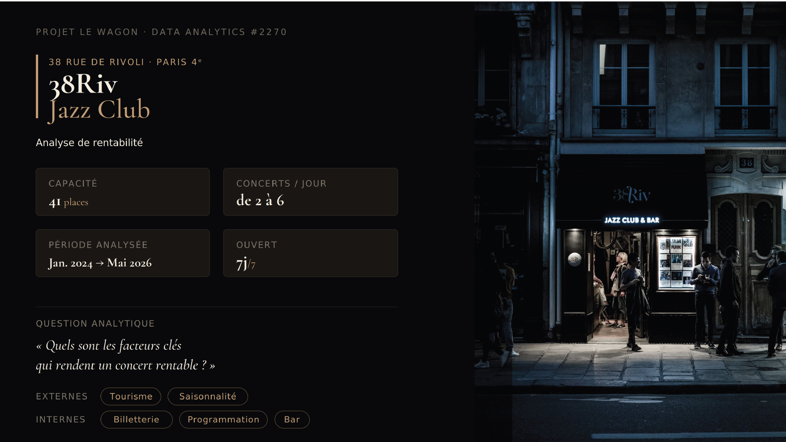

## 📌 Executive Summary
Located in the heart of Paris (38 Rue de Rivoli), **38 Riv** is an iconic jazz club offering daily live concerts and jam sessions. Following a management takeover, the club initiated a data-driven strategy to resolve historical profitability challenges and optimize its business model.

This project delivers an end-to-end Data Analytics & BI solution analyzing **2.5 years of transactional, operational, and financial data** (January 2024 – June 2026) to identify the key drivers of concert performance and profitability.

---

## 📊 Business Context & Key Insights

<table border="0" width="100%">
  <tr>
    <td width="33%" align="center">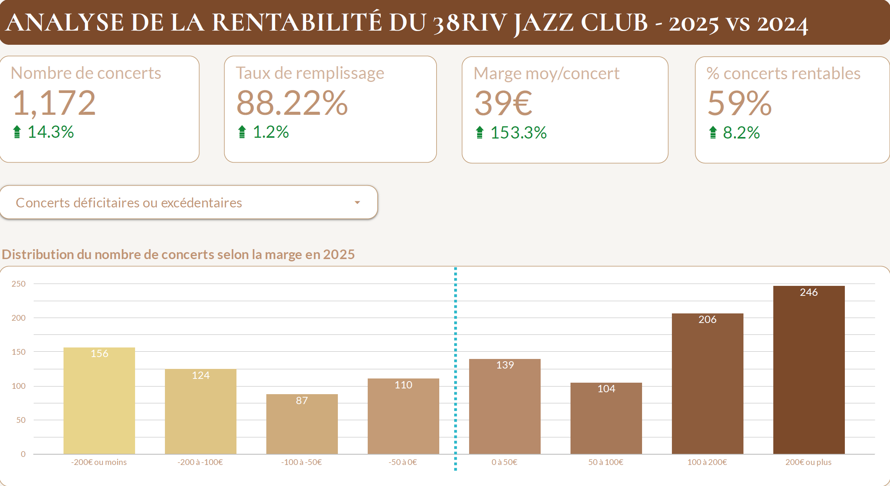</td>
    <td width="33%" align="center">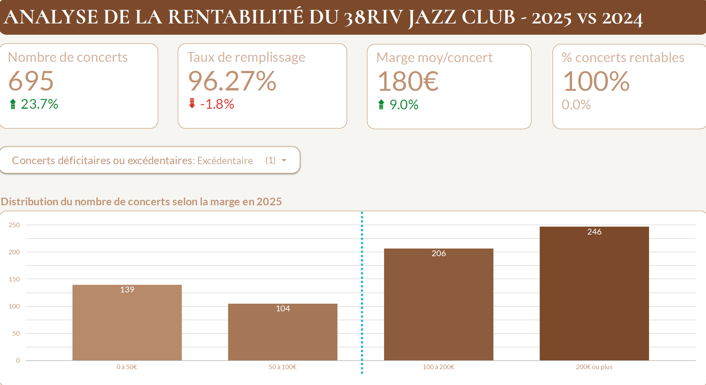</td>
    <td width="33%" align="center">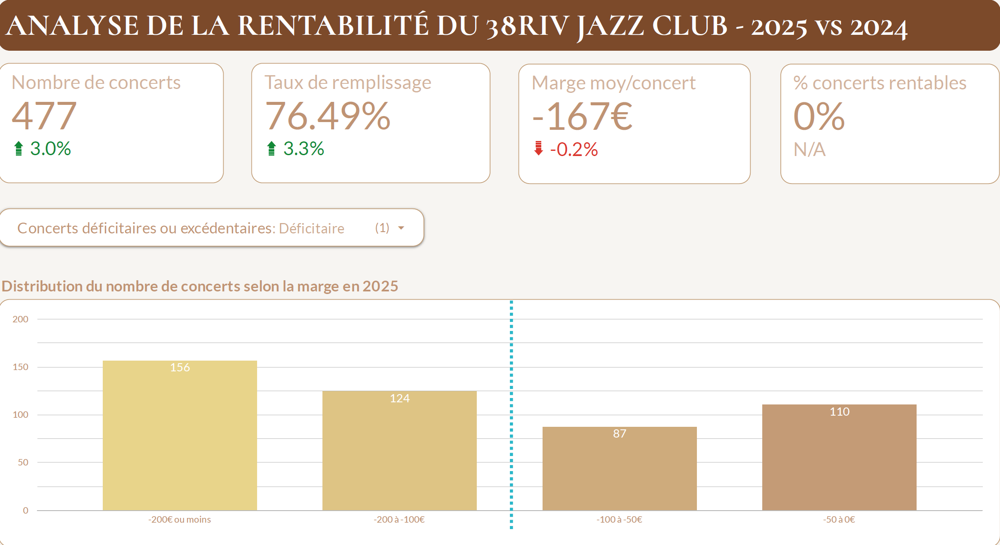</td>
  </tr>
</table>

### 1. Financial Baseline & Tipping Points
* **Overall Performance (2025):** High average occupancy rate of **88%**, with **60% of concerts operating at a profit**.
* **The "Tipping Point" Margin:** The difference between a profitable and a loss-making show is remarkably small:
  * **Profitable Concerts:** 96% average occupancy (~39/41 tickets sold).
  * **Unprofitable Concerts:** 76% average occupancy (~31/41 tickets sold).
* **Key Takeaway:** A swing of just **8 tickets** dictates break-even vs. deficit. Every single ticket sale directly impacts the bottom line.

---

### 2. External Drivers: Tourism & Seasonality

<table border="0" width="100%">
  <tr>
    <td width="50%" align="center">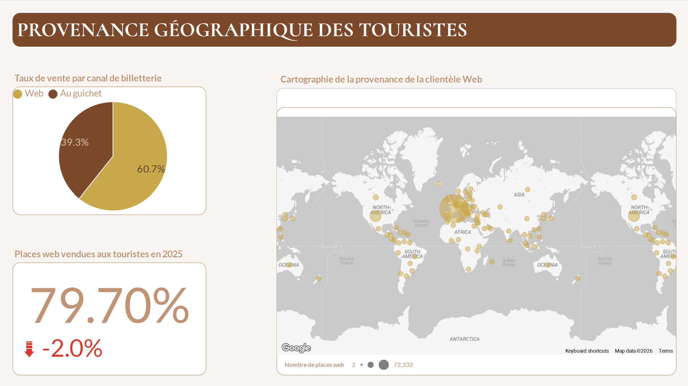</td>
    <td width="50%" align="center">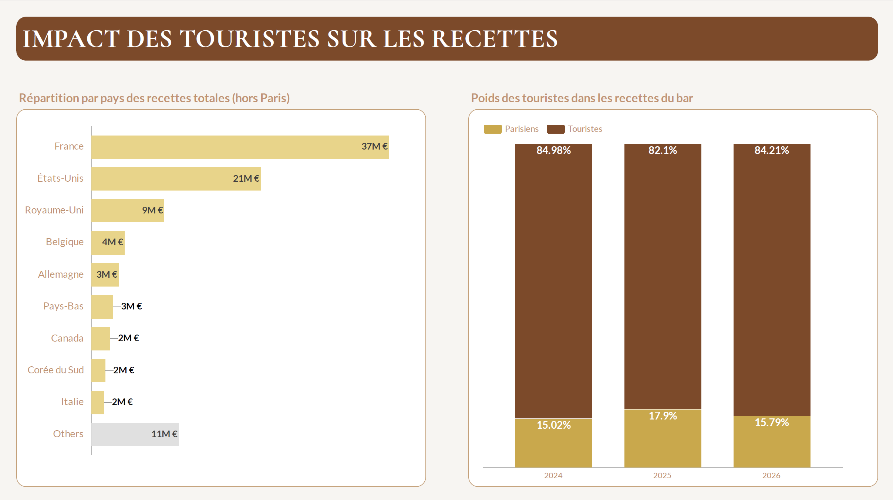</td>
  </tr>
</table>

* **High Tourist Dependence:** 60% of total ticket sales occur online. Geographic tracking of online purchases shows that **80% of buyers are tourists** (top markets: France, USA, UK).
* **Bar Spending Patterns:** Tourist clientele demonstrates a significantly higher Average Order Value (AOV) at the bar, showing a stronger willingness to purchase premium/complex cocktails compared to local patrons.
* **Weekly & Time-Slot Dynamics:**
  * **Peak Days:** Friday, Saturday, and Tuesday (driven by highly popular Funk Jam sessions).
  * **Late Sessions Innovation:** Introduced in September 2025 to bridge evening concerts and late-night jams, boosting Friday ticket margins to **>€400** (at ~80% occupancy).
  * **Slot Performance Gap:** Afternoon slots show low occupancy and near-zero bar margins. Conversely, Jam Sessions achieve **>90% occupancy** with maximum net bar margins.

<table border="0" width="100%">
  <tr>
    <td width="33%" align="center">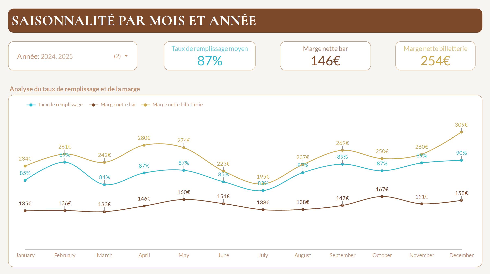</td>
    <td width="33%" align="center">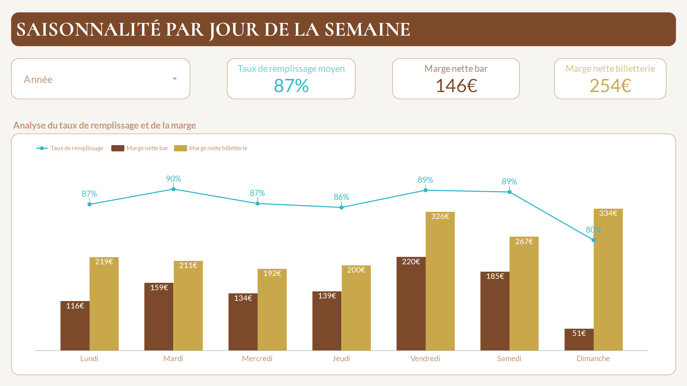</td>
    <td width="33%" align="center">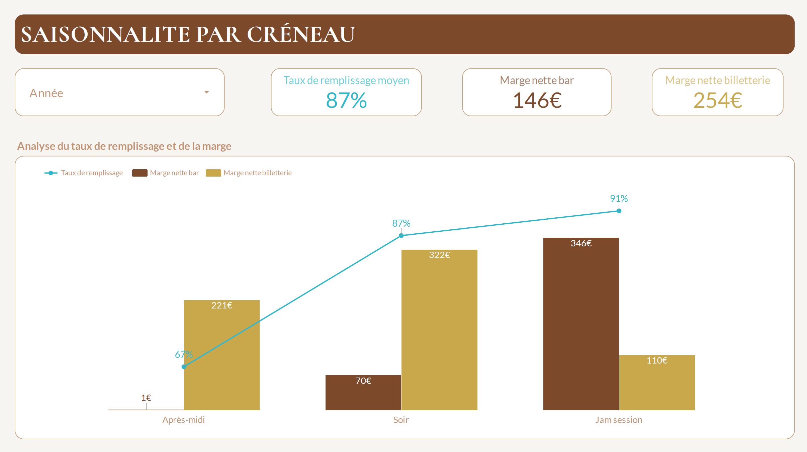</td>
  </tr>
</table>

---

### 3. Internal Drivers: Restructuring, Pricing & Bar Behavior

<table border="0" width="100%">
  <tr>
    <td width="33%" align="center">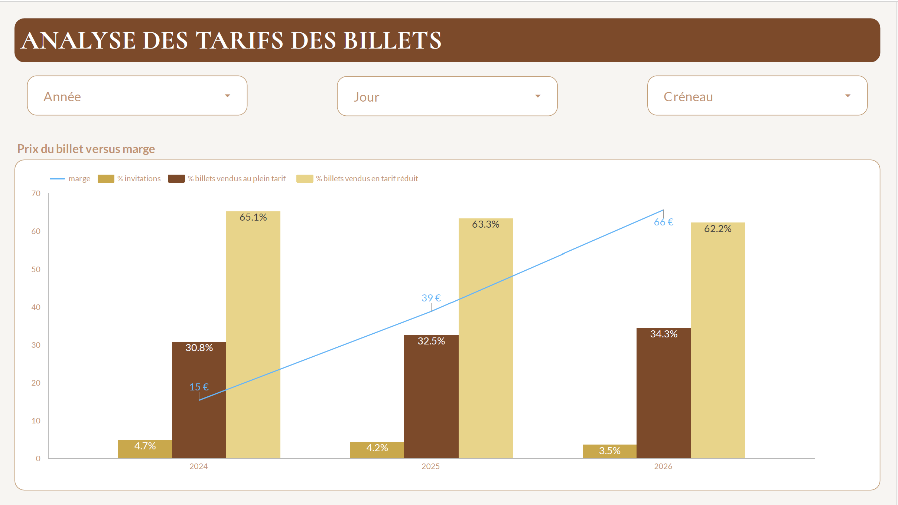</td>
    <td width="33%" align="center">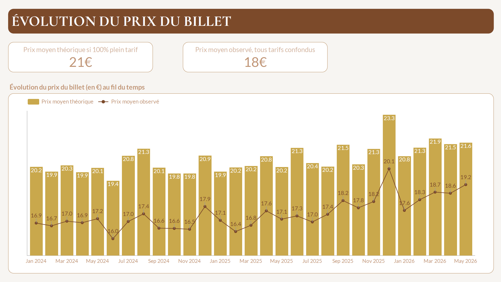</td>
    <td width="33%" align="center">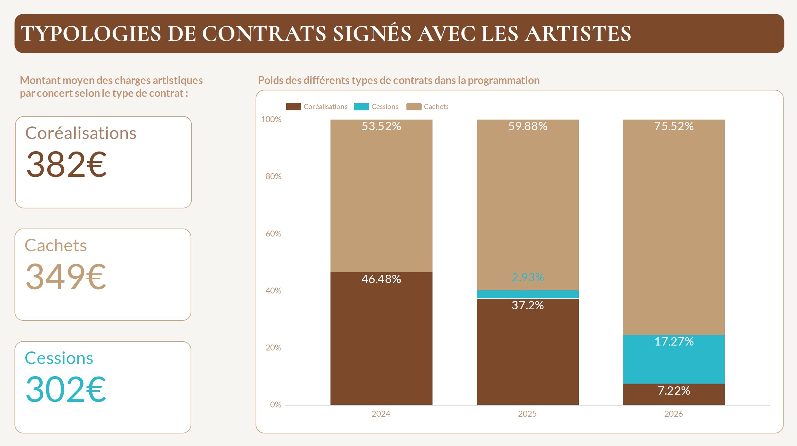</td>
  </tr>
</table>

* **Artist Contract Optimization:** The club shifted away from 50/50 Revenue Share (*Co-réalisations*, dropped from 50% down to 7%) towards Fixed Fees (*Cachets*, increased to 75%) and Negotiated Deals (*Cessions*, 17%), substantially lowering fixed performance costs.
* **Pricing Strategy:** Reduced complimentary tickets (*invitations*) by 25% while increasing Full-Price sales by 10%. Average realized ticket price rose from **~€17 to €19** starting late 2025.
* **Bar Consumption Minute-by-Minute Analysis:**
  * **Product Mix:** Beer (30%) and Cocktails account for **>50% of total bar revenue**. Menu layout heavily influences choice, as order volumes strictly follow menu item placement.
  * **Seating Impact on Sales:** Minute-by-minute tracking reveals steep drops in bar orders during seated concerts (guests avoid getting up). In contrast, standing Jam & Late Sessions sustain constant bar ordering throughout the night.

<table border="0" width="100%">
  <tr>
    <td width="50%" align="center">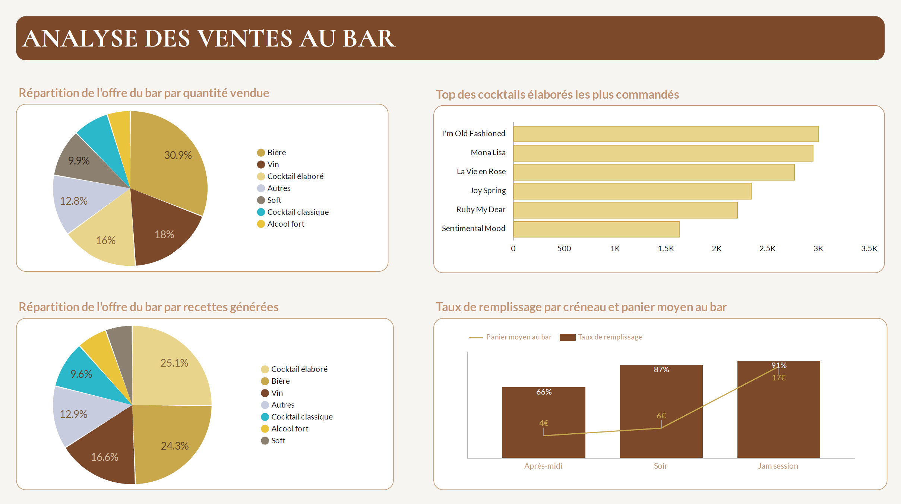</td>
    <td width="50%" align="center">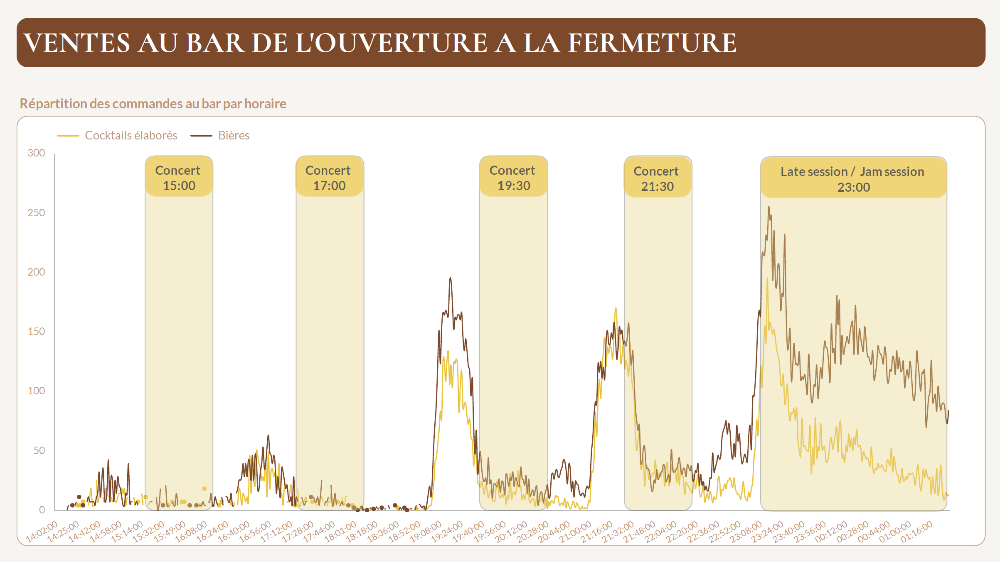</td>
  </tr>
</table>

---

## 💡 Strategic Recommendations

1. **Targeted Geo-Marketing:** Launch localized social media ad campaigns targeting US and UK tourists visiting Paris to capture high-AOV bar spenders.
2. **In-Seat Table Ordering (QR Code):** Implement QR-code ordering at tables during seated shows to remove friction and enable seamless bar orders without disturbing the performance.
3. **Afternoon Offer Pivot:** Transform low-performing afternoon slots by introducing curated tea/hot beverage bundles (*Tea Time* concept).
4. **Strategic Menu Engineering:** Feature high-margin/premium "Cocktail of the Day" options prominently at the top of the bar menu to leverage observed customer scanning habits.

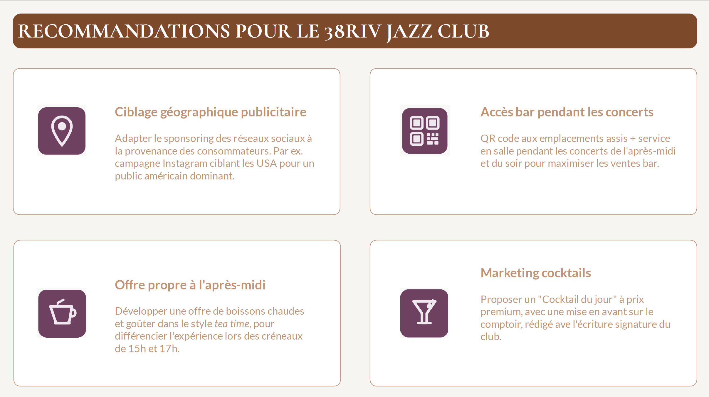

---

## 🔗 Interactive Dashboard
* **Looker Studio Dashboard:** [View Live Presentation & Analytics](https://datastudio.google.com/reporting/5fa5037e-b2e3-4089-8c66-ebf2b427d97a/page/p_gaunw5mi4d)

---

## 📁 Repository Structure

```text
38riv-jazzclub-analytics/
├── README.md                           # Executive summary & project documentation
├── dbt_project/                        # dbt transformation layer
│   ├── dbt_project.yml                 # dbt project configuration
│   ├── profiles.yml.example            # Sample profiles configuration for BigQuery connection
│   ├── models/                         # Modular SQL transformations
│   │   ├── staging/                    # Raw data cleaning, casting & renaming
│   │   │   ├── stg_tickets.sql
│   │   │   ├── stg_bar_sales.sql
│   │   │   ├── stg_concerts.sql
│   │   │   └── schema.yml
│   │   ├── intermediate/               # Business logic, joins & aggregations
│   │   │   ├── int_concert_occupancy.sql
│   │   │   ├── int_bar_minute_orders.sql
│   │   │   ├── int_tourist_profiling.sql
│   │   │   └── schema.yml
│   │   └── marts/                      # Production-ready BI tables
│   │       ├── fct_concert_profitability.sql
│   │       ├── fct_bar_consumption.sql
│   │       ├── dim_concerts.sql
│   │       └── schema.yml
│   └── tests/                          # Custom dbt data quality tests
├── notebooks/                          # Exploratory Data Analysis (EDA) & Python scripts
├── scripts/                            # Data loading & orchestration utilities
└── images/                             # Screenshots and visual assets for documentation
``text

---

## 🏗️ Architecture & Tech Stack
The analytics infrastructure is built on a modern Data Stack designed for scalability, governance, and seamless BI integration:

┌────────────────────────┐      ┌────────────────────────┐      ┌────────────────────────┐      ┌────────────────────────┐
│      RAW SOURCES       │      │     DATA WAREHOUSE     │      │  TRANSFORMATION LAYER  │      │    BI & DATA VISUAL    │
│                        │      │                        │      │                        │      │                        │
│  • Ticketing System    │ ───► │   Google BigQuery      │ ───► │        dbt Core        │ ───► │     Looker Studio      │
│  • POS Bar Transactions│      │  (Raw & Staging Layer) │      │(Modular Transformations│      │ (Executive Dashboards) │
│  • Concert Schedules   │      │                        │      │   & Quality Testing)   │      │                        │
└────────────────────────┘      └────────────────────────┘      └────────────────────────┘      └────────────────────────┘

* **Google BigQuery:** Enterprise Data Warehouse hosting raw operational data and analytical data marts.
* **dbt Core (Data Build Tool):** Manages SQL transformations, data lineage, quality testing, and documentation.
* **Looker Studio:** Interactive Business Intelligence platform delivering live executive dashboards.

